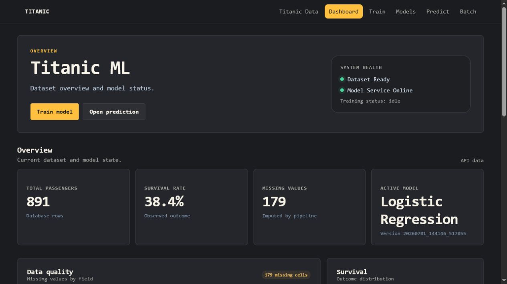
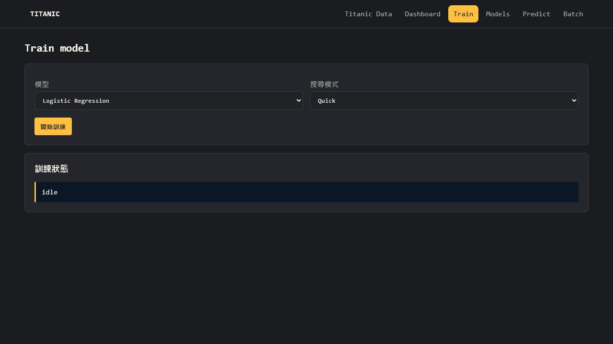
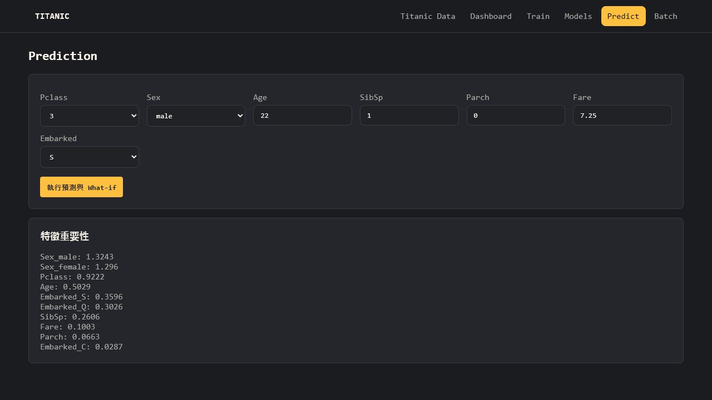
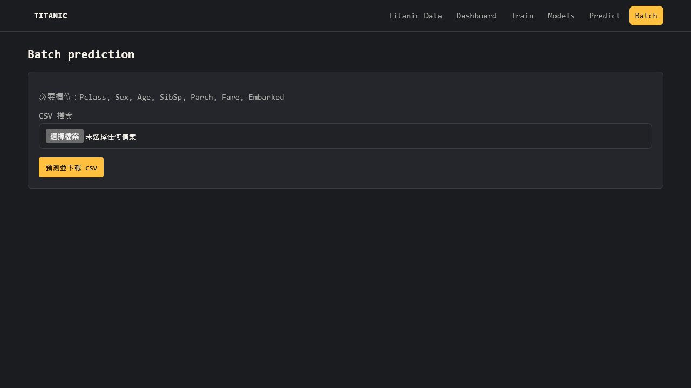

# 使用 Restful API 與 Ajax 來進行機器學習模型訓練與預測

## 專案介紹

本專案基於 Titanic RESTful API + Ajax CRUD 作業擴充為 **Titanic ML Control Tower**。原有乘客資料 CRUD 保留，新增資料概覽、模型訓練、版本管理、單筆預測、What-if 模擬、CSV 批次預測與特徵重要性。

## 功能特色

- Titanic 資料管理與分頁搜尋
- ML Dashboard 資料概覽與缺失值統計
- Logistic Regression、Random Forest、Gradient Boosting、Extra Trees、SVM 一鍵訓練
- quick、balanced、full 三種 GridSearchCV 超參數搜尋
- Ajax 輪詢 idle、training、completed、failed 狀態
- Accuracy、Precision、Recall、F1、ROC-AUC、Confusion Matrix
- joblib Pipeline 與 JSON metadata 模型版本管理
- Active Model 與 Champion Model
- 單筆生存率、風險等級及規則式解釋
- What-if 條件變化模擬
- CSV 批次預測與結果下載
- 模型特徵重要性

## 專案結構

```text
restful_api_ajax-master/
├── images/                         # README 成果截圖
│   ├── demo_dashboard.png
│   ├── demo_train.png
│   ├── demo_predict.png
│   └── demo_batch.png
├── models/                         # 首次訓練後自動建立
│   ├── active_model.json
│   ├── titanic_model_*.joblib
│   └── titanic_model_*.json
├── titanic_restful_project/
│   ├── app.py                      # CRUD、頁面與 RESTful API
│   ├── ml_service.py               # 訓練、版本與預測流程
│   ├── init_db.py
│   ├── my_db.db
│   ├── titanic.csv
│   ├── test_ml.py
│   ├── static/
│   │   └── wandb-theme.css         # 全站 W&B 配色與 Consolas 字體
│   └── templates/
│       └── ml.html                 # 共用 ML 互動介面
├── requirements.txt
└── README.md
```

## 安裝套件

目前驗證環境為 Python 3.12，主要版本如下：

- Flask==3.1.3
- pandas==3.0.3
- numpy==2.4.6
- scikit-learn==1.8.0
- joblib==1.5.3

請先確認目前位置在專案根目錄：

```text
restful_api_ajax-master/
```

### Windows PowerShell

```powershell
python -m venv .venv
Set-ExecutionPolicy -Scope Process -ExecutionPolicy Bypass
.\.venv\Scripts\Activate.ps1
python -m pip install -r requirements.txt
```

若 PowerShell 出現 `PSSecurityException`，或顯示「因為這個系統上已停用指令碼執行，所以無法載入 Activate.ps1」，請先執行：

```powershell
Set-ExecutionPolicy -Scope Process -ExecutionPolicy Bypass
```

再重新啟動虛擬環境：

```powershell
.\.venv\Scripts\Activate.ps1
```

`-Scope Process` 只會影響目前這個 PowerShell 視窗，關閉終端機後會恢復原本設定。

### Windows CMD

```cmd
python -m venv .venv
.venv\Scripts\activate.bat
python -m pip install -r requirements.txt
```

### Git Bash

```bash
python -m venv .venv
source .venv/Scripts/activate
python -m pip install -r requirements.txt
```

### Linux / WSL / macOS

```bash
python -m venv .venv
source .venv/bin/activate
python -m pip install -r requirements.txt
```

## 執行方法

從零重建資料庫時，`init_db.py` 會覆寫 `my_db.db`，請先確認不需保留自行新增的乘客資料。

```bash
# Linux / WSL
cd titanic_restful_project
python init_db.py
python app.py
```

瀏覽 `http://127.0.0.1:5000/` 查看 CRUD，或開啟 `http://127.0.0.1:5000/ml/dashboard` 進入 ML Control Tower。

## 頁面

| 路徑 | 功能 |
| --- | --- |
| `/` | Titanic CRUD |
| `/ml/dashboard` | 控制中心、KPI、資料品質、存活概況與 ML 工作流狀態 |
| `/ml/train` | 模型訓練與狀態 |
| `/ml/models` | 模型比較與啟用 |
| `/ml/predict` | 單筆預測、What-if、特徵重要性 |
| `/ml/batch` | CSV 批次預測與下載 |

## API 說明

| Method | API | 功能 |
| --- | --- | --- |
| GET | `/api/ml/dashboard` | Titanic 資料概況 |
| POST | `/api/ml/train` | 啟動背景訓練 |
| GET | `/api/ml/train/status` | 訓練狀態 |
| GET | `/api/ml/train/result` | 最近訓練結果 |
| GET | `/api/ml/models` | 模型版本列表 |
| POST | `/api/ml/models/use` | 設定 active model |
| POST | `/api/ml/predict` | 單筆預測 |
| POST | `/api/ml/predict/what-if` | What-if 模擬 |
| POST | `/api/ml/predict/csv` | CSV 批次預測 |
| GET | `/api/ml/feature-importance` | 特徵重要性 |

## 說明

### 資料與前處理

- 預測目標：`Survived`
- 模型特徵：`Pclass`、`Sex`、`Age`、`SibSp`、`Parch`、`Fare`、`Embarked`
- 數值缺失值：使用 median 補值並以 `StandardScaler` 標準化
- 類別缺失值：使用 most frequent 補值，再以 `OneHotEncoder` 轉換
- 資料切分：80% 訓練集、20% 測試集，固定 `random_state=42` 並依 `Survived` 分層抽樣
- 超參數搜尋：`GridSearchCV`、5-fold cross validation，以 ROC-AUC 選擇最佳參數

前處理與分類器會封裝成同一個 scikit-learn `Pipeline`。訓練完成後直接儲存整條 Pipeline，避免預測階段使用不同的補值或欄位轉換方式。

### 使用模型與目前最佳超參數

下表是目前 `models/*.json` 實際保存的 quick 模式結果，不是預先寫死的示範數字：

| 模型 | 目前最佳超參數 | Accuracy | F1 | ROC-AUC |
| --- | --- | ---: | ---: | ---: |
| Logistic Regression | `C=1.0`, `solver=liblinear`, `max_iter=500` | 80.45% | 72.44% | 84.37% |
| Random Forest | `n_estimators=100`, `max_depth=8`, `min_samples_split=2`, `min_samples_leaf=1` | 80.45% | 72.00% | 83.98% |
| Gradient Boosting | `n_estimators=100`, `learning_rate=0.1`, `max_depth=3` | 79.89% | 71.43% | 81.81% |
| Extra Trees | `n_estimators=200`, `max_depth=8`, `min_samples_leaf=2` | 80.45% | 70.09% | **84.90%** |
| SVM | `C=1`, `kernel=rbf`, `gamma=scale` | **81.56%** | **73.60%** | 84.01% |

### 搜尋模式與模型版本

- `quick`：最少組合，適合展示與快速驗證流程
- `balanced`：增加候選參數，兼顧時間與搜尋範圍
- `full`：搜尋範圍最大，執行時間最長

每次有效訓練會在 `models/` 儲存 `.joblib` Pipeline 與 `.json` metadata。metadata 包含模型名稱、版本、建立時間、最佳參數、評估指標、特徵欄位及前處理說明。完全相同的演算法、搜尋模式、參數與評估結果會重用既有模型，不再建立重複檔案。預測 API 使用 `active_model.json` 指定的模型，目前 active model 版本為 `20260701_144146_517055`。

## 測試

測試會執行一次 Logistic Regression quick 訓練，並產生模型檔。

```bash
# Linux / WSL
cd titanic_restful_project
python -m unittest -v test_ml.py
```

預期結果為 `OK`。若失敗，先確認 `my_db.db` 存在、包含 891 筆資料，且 requirements 已安裝。

手動驗證順序：

1. 在 `/ml/train` 選擇模型及 quick，確認狀態變成 completed 並顯示最佳參數。
2. 在 `/ml/models` 確認模型版本與 Active 標記。
3. 在 `/ml/predict` 輸入乘客資料，確認機率、風險、解釋與 What-if 結果。
4. 在 `/ml/batch` 上傳至少含必要七欄的 CSV，確認畫面預覽並下載結果。

## 成果

### ML Dashboard



### 模型訓練



### 單筆預測與 What-if


### CSV 批次預測


### 展示影片

[Titanic ML 專案展示影片](https://www.youtube.com/watch?v=-Dcp0Dqo8TU&feature=youtu.be)

